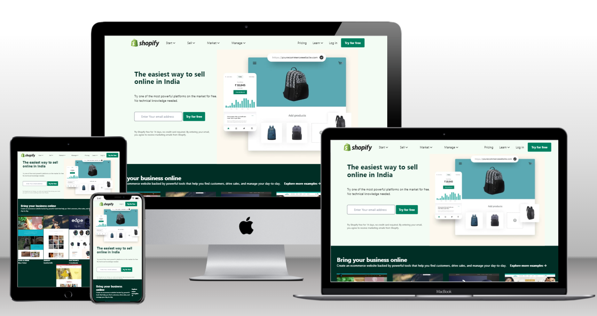

Hi there,

I have Built my second **Tailwind Project.**

 
>Clone of Shopify Homepage

Take Aways,
 
Got a proper understanding on Tailwind CSS. 

Learned show to plan the design of anywebsite.

Learned how to read the documentation.

Gained confindence on building the websites. 

This project took me around 10hrs to build.

[Livelink]("https://shopify-clone-vivektenali.netlify.app/")

  

## Screenshots

> Thank You  [Hitesh Sir](https://hiteshchoudhary.com/) for the guidance. 

**I Write Code**

 **ineuron.ai** 